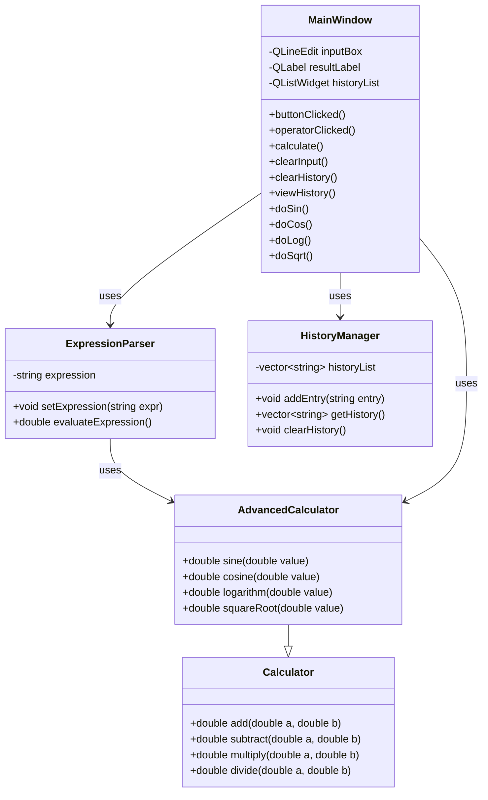

# Advanced Calculator (C++ / Qt)

## Overview

This project is a GUI-based calculator built using C++ and Qt. It started as a basic calculator but was expanded to include advanced math functions and a more interactive history system.

The goal of this project was to practice object-oriented programming, build a working GUI, and handle user input in a clean and organized way.

---

## Features

### Basic Operations

* Addition (+)
* Subtraction (-)
* Multiplication (*)
* Division (/)

### Advanced Functions

* sin(x)
* cos(x)
* log(x)
* sqrt(x)

Instead of calculating right away, these functions get added to the input so you can build full expressions before hitting calculate.

---

## GUI Features

* Input box for typing expressions
* Number and operator buttons
* Function buttons (sin, cos, log, sqrt)
* "Calculate" button to evaluate expressions
* "C" button to clear input
* History list showing previous calculations
* "Clear History" button (hides history but doesn’t delete it)
* "View History" button to bring it back

---

## History System

* Every calculation is saved
* You can clear the history from the screen without losing it permanently
* Clicking on a past calculation puts it back into the input box so you can reuse or edit it

---

## Error Handling

The program handles common errors like:

* Dividing by zero
* Invalid input
* Log of zero or negative numbers
* Square root of negative numbers

---

## How the Code is Organized (OOP)

* **Calculator**

  * Handles basic math operations

* **AdvancedCalculator**

  * Inherits from Calculator
  * Adds sin, cos, log, sqrt

* **ExpressionParser**

  * Takes the input string and evaluates it

* **HistoryManager**

  * Stores and manages past calculations

* **MainWindow**

  * Handles the GUI and user interaction

---

## UML Diagram

---

## How to Run

1. Open the project in Qt Creator
2. Build the project
3. Run it

---

## Summary

This project shows how to combine C++ with Qt to build a working application using object-oriented programming. It includes both basic and advanced features, along with a GUI and a usable history system.
